<div align="center">


<br>


<br><br>


<br><br>

<a href="#">
  
</a>
<a href="https://linkedin.com/in/hardik6301">
  
</a>
<a href="mailto:hardik0512.be23@chitkara.edu.in">
  
</a>
<a href="https://github.com/hardik6301">
  
</a>

<br><br>


</div>

---

## About

Software Engineering undergraduate at **Chitkara University (CGPA 8.30)** focused on building production-grade systems across **AI, full-stack, and mobile**.

I engineer products end-to-end — from architecture and APIs to secure auth, payments, and deployment. My work spans enterprise iOS at **Infosys**, AI SaaS platforms, and App Store–published mobile applications.

I care about clean architecture, measurable impact, and shipping systems that are reliable under real users.

### Open To

- Software Engineering Internships
- AI / ML Engineering Roles
- Full Stack & Backend Engineering
- Open Source Collaboration
- Research Collaborations

---

## Tech Stack

<div align="center">

### Languages


### Frontend


### Backend & Databases


### Cloud, DevOps & Tooling


</div>

---

## AI / ML Expertise

<div align="center">

| Domain | Proficiency | Details |
|:-------|:-----------:|:--------|
| Large Language Models | ★★★★★ | Gemini API integrations, structured outputs, production AI workflows |
| Retrieval-Augmented Generation | ★★★★★ | LangChain + Pinecone pipelines for grounded, citation-aware Q&A |
| Prompt Engineering | ★★★★★ | Deterministic prompting for reliable, product-ready AI behavior |
| Semantic Search | ★★★★☆ | Vector embeddings for high-quality document retrieval |
| AI SaaS Development | ★★★★★ | End-to-end AI products with Next.js, Supabase, and payments |
| Auth & Security for AI Apps | ★★★★☆ | JWT sessions, RLS policies, server-enforced access control |

</div>

---

## Featured Projects

<details>
<summary><b>Travora — AI Travel Planning SaaS</b></summary>
<br>

Production AI travel platform that turns natural language prompts into complete itineraries, with freemium monetization, secure payments, and persistent trip storage.

| Metric | Details |
|:-------|:--------|
| **Stack** | Next.js · React · Tailwind · Supabase · PostgreSQL · Gemini API · Razorpay · Vercel |
| **Scale** | Multi-user SaaS with auth, subscriptions, and persistent trip data |
| **Performance** | Dynamic itinerary updates without full page reloads |
| **Security** | JWT auth · Supabase RLS · Razorpay HMAC verification |
| **Impact** | End-to-end AI SaaS demonstrating product + engineering ownership |
| **Repository** | [ai-trip-planner](https://github.com/hardik6301/ai-trip-planner) |

Travora combines conversational AI with a real business model — freemium access, Pro upgrades, and server-side payment validation — built as a scalable full-stack product rather than a demo.

</details>

<br>

<details>
<summary><b>ClubHub — Campus Club Management Platform</b></summary>
<br>

Cross-platform campus operations app for club administration, events, attendance, and multi-role workflows. Published on the Apple App Store.

| Metric | Details |
|:-------|:--------|
| **Stack** | SwiftUI · Flutter · Supabase · PostgreSQL · MVVM |
| **Scale** | Multi-role platform (admins, members, event workflows) |
| **Performance** | Supabase RPCs for efficient backend operations |
| **Security** | PKCE authentication · role-based access control |
| **Impact** | Production App Store release with real campus use cases |
| **Repository** | [clubhub-admin](https://github.com/hardik6301/clubhub-admin) |

ClubHub was engineered for production reliability — MVVM architecture, reusable components, and a full migration path from SwiftUI to Flutter while preserving feature parity.

</details>

<br>

<details>
<summary><b>DocBot — RAG Document Assistant</b></summary>
<br>

AI document intelligence system that ingests PDFs/PPTs, retrieves relevant context via vector search, and answers with grounded citations.

| Metric | Details |
|:-------|:--------|
| **Stack** | Next.js · LangChain · Gemini API · Pinecone · PostgreSQL |
| **Scale** | Document ingestion → chunking → embeddings → retrieval pipeline |
| **Performance** | Similarity search optimized for low-latency context selection |
| **Security** | Controlled document access with authenticated workflows |
| **Impact** | Production-oriented GenAI architecture with reduced hallucinations |
| **Repository** | Coming soon |

DocBot focuses on retrieval-first design — chunking, embeddings, and citation-backed responses — the same patterns used in enterprise knowledge assistants.

</details>

<br>

<details>
<summary><b>SportShield AI — Digital Sports Media Integrity</b></summary>
<br>

AI + cloud verification system for protecting ownership and integrity of sports media against unauthorized use, tampering, and duplication.

| Metric | Details |
|:-------|:--------|
| **Stack** | AI pipelines · Cloud verification · Media integrity workflows |
| **Scale** | Designed for digital sports content ecosystems |
| **Performance** | Automated verification over media assets |
| **Security** | Ownership validation and tamper detection focus |
| **Impact** | Applied AI for real-world media authenticity problems |
| **Repository** | [SportShield-AI](https://github.com/hardik6301/SportShield-AI) |

</details>

---

## Experience

<table>
<tr>
<td width="22%" align="center" valign="top">

**Dec 2025 — Jan 2026**

</td>
<td width="78%">

### iOS Developer Intern · Infosys Limited
**Mysore, India**

Built production modules for an enterprise Learning & Training Management System in an Agile environment — scalable UI architecture, API integration, and collaborative delivery.

**Scope**
- Developed role-based SwiftUI modules using MVVM
- Integrated REST APIs for courses, schedules, and progress tracking
- Validated backend contracts and structured JSON parsing
- Participated in sprint planning, stand-ups, and code reviews
- Used Git + Jira across the full SDLC

`SwiftUI` `MVVM` `REST APIs` `JSON` `Git` `Jira` `Agile` `iOS` `Xcode`

</td>
</tr>
</table>

---

## Achievements

<div align="center">

| Recognition | Details |
|:------------|:--------|
| **1st Place Winner** | Accathon — *Ignite: Build a Unicorn* |
| **Best Cadet Award** | National Cadet Corps |
| **NCC A & B Certificates** | National Cadet Corps certified |
| **App Store Release** | ClubHub published on the Apple App Store |
| **Enterprise Internship** | Infosys Limited — iOS Developer Intern |
| **AI Product Engineering** | Multiple production AI applications shipped |

</div>

---

## Certifications

<div align="center">

### AWS


### Oracle


### NPTEL


### Cisco


</div>

---

## Coding Profiles

<div align="center">

<a href="https://leetcode.com/u/hardik6301/">
  
</a>
<a href="https://www.geeksforgeeks.org/user/hardik6301/">
  
</a>
<a href="https://www.hackerrank.com/hardik6301">
  
</a>
<a href="https://www.codechef.com/users/hardik6301">
  
</a>

</div>

---

## GitHub Analytics

<div align="center">


<br><br>


</div>

---

## GitHub Trophies

<div align="center">

<!-- Static SVG refreshed by .github/workflows/trophies.yml (official trophy API is rate-limited) -->
<a href="https://github.com/ryo-ma/github-profile-trophy">
  
</a>

</div>

---

## Contribution Activity

<div align="center">


</div>

---

## Contribution Snake

<div align="center">

<!-- Generated by .github/workflows/snake.yml onto the `output` branch -->
<picture>
  <source media="(prefers-color-scheme: dark)" srcset="https://raw.githubusercontent.com/hardik6301/hardik6301/output/github-contribution-grid-snake-dark.svg"/>
  <source media="(prefers-color-scheme: light)" srcset="https://raw.githubusercontent.com/hardik6301/hardik6301/output/github-contribution-grid-snake.svg"/>
  
</picture>

</div>

---

## Current Focus

```yaml
learning:
  - Advanced System Design
  - Distributed Systems
  - AI Agents
  - Cloud Architecture
  - DSA for Interviews

building:
  - DocBot (RAG Assistant)
  - Travora (AI SaaS)
  - portfolio
  - dsa-java

exploring:
  - Multi-Agent Systems
  - RAG Optimization
  - Scalable Backend Systems
  - Production AI Applications

open_to:
  - Software Engineering Internships
  - AI Engineer Roles
  - Full Stack Development
  - Backend Engineering
  - Open Source Collaboration
```

---

## Connect

<div align="center">

<a href="mailto:hardik0512.be23@chitkara.edu.in">
  
</a>
<a href="https://linkedin.com/in/hardik6301">
  
</a>
<a href="https://github.com/hardik6301">
  
</a>
<a href="#">
  
</a>

</div>

---

<div align="center">

### *"Build systems that scale. Ship products that matter."*

<br>


</div>
